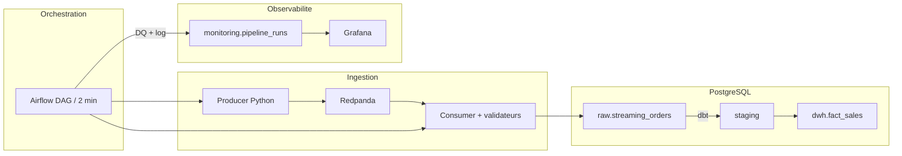
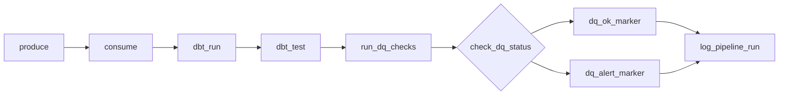

# UNICLOTHES - Pipeline temps réel

Pipeline micro-batch pour Uniclothes, une enseigne de mode omnicanale. Les commandes web et boutique transitent par Kafka, sont validées, transformées en entrepôt PostgreSQL, contrôlées en qualité et monitorées via Airflow et Grafana.

---

## Architecture



Le DAG `uniclos_realtime_pipeline` enchaîne neuf tâches toutes les deux minutes :



---

## Démarrage rapide

**Prérequis** : Docker Desktop, PowerShell.

### 1. Configurer les secrets

```powershell
cd docker
copy .env.example .env
# Renseigner les mots de passe dans .env (fichier gitignore)
```

### 2. Lancer la stack

```powershell
powershell -ExecutionPolicy Bypass -File scripts\start.ps1
```

Attendre **2–3 minutes**, puis vérifier :

```powershell
cd docker
docker compose ps
```

Tous les services doivent être **Up** ou **healthy**.

### 3. Déclencher le pipeline

```powershell
powershell -ExecutionPolicy Bypass -File scripts\run_demo.ps1
```

Ou dans Airflow : activer `uniclos_realtime_pipeline` → **Trigger DAG**.

---

## Accès aux services

| Service | URL | Identifiants |
|---------|-----|--------------|
| Airflow | http://localhost:8080 | `AIRFLOW_ADMIN_*` dans `docker/.env` |
| Grafana | http://localhost:3002 | `GRAFANA_ADMIN_*` dans `docker/.env` |
| PostgreSQL | localhost:5433 | `POSTGRES_*` dans `docker/.env` |
| MinIO | http://localhost:9011 | `MINIO_ROOT_*` dans `docker/.env` |

---

## Structure du projet

| Dossier | Rôle |
|---------|------|
| `dags/` | DAG Airflow |
| `python/` | Producers, consumers, DQ |
| `dbt/` | Modèles staging + `fact_sales` |
| `sql/init/` | DDL PostgreSQL + seeds |
| `docker/` | Compose, Grafana, Prometheus, `.env` |
| `tests/` | pytest |
| `docs/` | Slides, script vidéo, diagramme Draw.io |
| `scripts/` | `start.ps1`, `run_demo.ps1`, `fix_dbt.ps1`, `demo_rgpd.ps1` |

---

## Commandes utiles

```powershell
# Tests unitaires
pip install -r requirements.txt
pytest tests/ -v

# Corriger dbt / recharger fact_sales
powershell -ExecutionPolicy Bypass -File scripts\fix_dbt.ps1

# RBAC + demo RGPD (stack deja demarree)
powershell -ExecutionPolicy Bypass -File scripts\apply_phase_a.ps1
powershell -ExecutionPolicy Bypass -File scripts\demo_rgpd.ps1

# Regenerer config Grafana apres changement .env
powershell -ExecutionPolicy Bypass -File scripts\render_config.ps1
```

---

## Dépannage

```powershell
cd docker
docker compose logs airflow-scheduler --tail 40
docker compose logs postgres --tail 20
```

Relance propre (supprime les volumes) :

```powershell
powershell -ExecutionPolicy Bypass -File scripts\start.ps1
```

---

## Documentation

- [Architecture détaillée](docs/architecture.md)
- [Plan slides soutenance](docs/slides-outline.md)
- [Script vidéo démo](docs/video-script.md)
